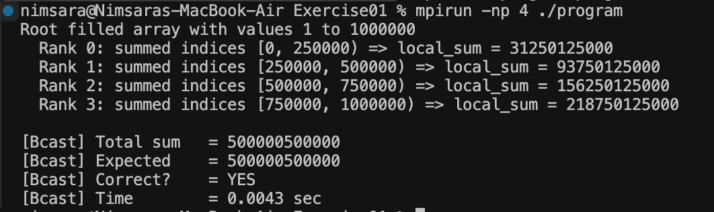

# Exercise 01 — MPI Broadcast + Send/Recv

## Objective

Understand how `MPI_Bcast` distributes the full array to all processes and how `MPI_Send` / `MPI_Recv` are used to collect partial sums at the root process.

## Compile and Run

```bash
mpicc -o program program.c
mpirun -np 4 ./program
```

## Output

```text
Root filled array with values 1 to 1000000
Rank 0: summed indices [0, 250000) => local_sum = 31250125000
Rank 1: summed indices [250000, 500000) => local_sum = 93750125000
Rank 2: summed indices [500000, 750000) => local_sum = 156250125000
Rank 3: summed indices [750000, 1000000) => local_sum = 218750125000

[Bcast] Total sum   = 500000500000
[Bcast] Expected    = 500000500000
[Bcast] Correct?    = YES
[Bcast] Time        = 0.0043 sec
```

## Result

The array was divided among 4 MPI processes and the calculated total matched the expected result:

**500,000,500,000**

Therefore, the implementation produced the correct result.

## Proof


