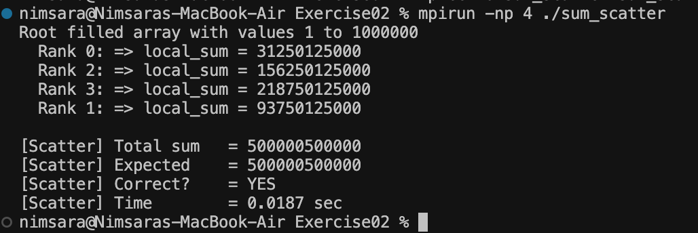

# Exercise 02 — MPI Scatter

## Objective

This exercise improves the array distribution method used in Exercise 01.

In Exercise 01, `MPI_Bcast` sent the complete array to every process.  
In this exercise, `MPI_Scatter` divides the array into equal chunks and sends only the required chunk to each process.

The `MPI_Send` and `MPI_Recv` method from Exercise 01 is still used to collect the partial sums.

## Improvement from Exercise 01

**Exercise 01**

```text
Full Array → Rank 0
Full Array → Rank 1
Full Array → Rank 2
Full Array → Rank 3
```

**Exercise 02**

```text
Chunk 0 → Rank 0
Chunk 1 → Rank 1
Chunk 2 → Rank 2
Chunk 3 → Rank 3
```

With 4 processes, each process receives and sums `250,000` elements instead of receiving the full `1,000,000` element array.

## Compile and Run

```bash
mpicc -o sum_scatter program.c
mpirun -np 4 ./sum_scatter
```

## Output

```text
Root filled array with values 1 to 1000000
  Rank 0: => local_sum = 31250125000
  Rank 2: => local_sum = 156250125000
  Rank 3: => local_sum = 218750125000
  Rank 1: => local_sum = 93750125000

[Scatter] Total sum   = 500000500000
[Scatter] Expected    = 500000500000
[Scatter] Correct?    = YES
[Scatter] Time        = 0.0187 sec
```

## Result

`MPI_Scatter` successfully distributed separate parts of the array among the 4 MPI processes.

Each process calculated its own `local_sum`, and the partial results were collected at the root process.

The final result matched the expected value:

**500,000,500,000**

The order of the rank outputs may vary because the MPI processes execute in parallel.

## Proof

