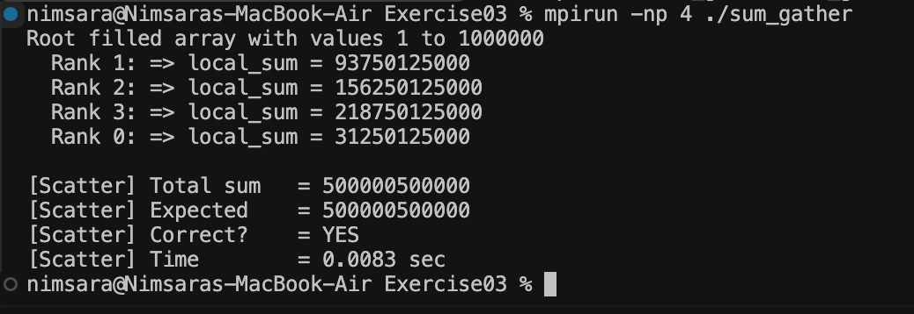

# Exercise 03 — MPI Gather

## Objective

This exercise improves the result collection method used in Exercise 02.

`MPI_Scatter` is still used to divide the original array into equal chunks. However, instead of using individual `MPI_Send` and `MPI_Recv` operations to return each partial sum to the root process, `MPI_Gather` collects all local sums in a single collective operation.

## Improvement from Exercise 02

**Exercise 02**

```text
MPI_Scatter
     ↓
Each rank calculates local_sum
     ↓
MPI_Send / MPI_Recv
     ↓
Root calculates total_sum
```

**Exercise 03**

```text
MPI_Scatter
     ↓
Each rank calculates local_sum
     ↓
MPI_Gather
     ↓
recv_array[] on Rank 0
     ↓
Root calculates total_sum
```

`MPI_Gather` collects one `local_sum` from every process, including Rank 0, and stores them in rank order on the root process.

## Compile and Run

```bash
mpicc -o sum_gather program.c
mpirun -np 4 ./sum_gather
```

## Output

```text
Root filled array with values 1 to 1000000
  Rank 1: => local_sum = 93750125000
  Rank 2: => local_sum = 156250125000
  Rank 3: => local_sum = 218750125000
  Rank 0: => local_sum = 31250125000

[Gather] Total sum   = 500000500000
[Gather] Expected    = 500000500000
[Gather] Correct?    = YES
[Gather] Time        = 0.0083 sec
```

## Result

`MPI_Gather` successfully collected the partial sums from all 4 MPI processes into the root process.

The root then manually added the gathered values to calculate the final sum.

The calculated result matched the expected value:

**500,000,500,000**

The order in which individual ranks print their local sums may vary because the MPI processes execute in parallel.

## Proof

