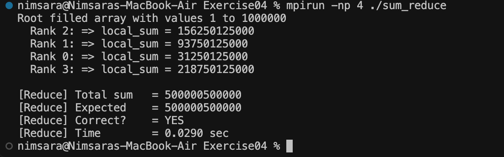

# Exercise 04 — MPI Reduce

## Objective

This exercise improves the result calculation used in Exercise 03.

`MPI_Scatter` is still used to divide the original array into equal chunks. However, instead of using `MPI_Gather` to collect every partial sum and manually adding them on the root process, `MPI_Reduce` combines the partial sums automatically using `MPI_SUM`.

## Improvement from Exercise 03

**Exercise 03**

```text
MPI_Scatter
     ↓
Each rank calculates local_sum
     ↓
MPI_Gather
     ↓
recv_array[] on Rank 0
     ↓
Manual summation
     ↓
total_sum
```

**Exercise 04**

```text
MPI_Scatter
     ↓
Each rank calculates local_sum
     ↓
MPI_Reduce + MPI_SUM
     ↓
total_sum on Rank 0
```

With `MPI_Reduce`, the root process no longer needs a separate receive array or a manual loop to calculate the final sum.

## Compile and Run

```bash
mpicc -o sum_reduce sum_reduce.c
mpirun -np 4 ./sum_reduce
```

## Output

```text
Root filled array with values 1 to 1000000
  Rank 2: => local_sum = 156250125000
  Rank 1: => local_sum = 93750125000
  Rank 0: => local_sum = 31250125000
  Rank 3: => local_sum = 218750125000

[Reduce] Total sum   = 500000500000
[Reduce] Expected    = 500000500000
[Reduce] Correct?    = YES
[Reduce] Time        = 0.0290 sec
```

## Result

`MPI_Reduce` successfully combined the `local_sum` values from all 4 MPI processes using `MPI_SUM`.

The final result was stored directly in `total_sum` on Rank 0, removing the need for `recv_array[]` and manual summation.

The calculated result matched the expected value:

**500,000,500,000**

The rank output order may vary between executions because MPI processes run concurrently.

## Proof

