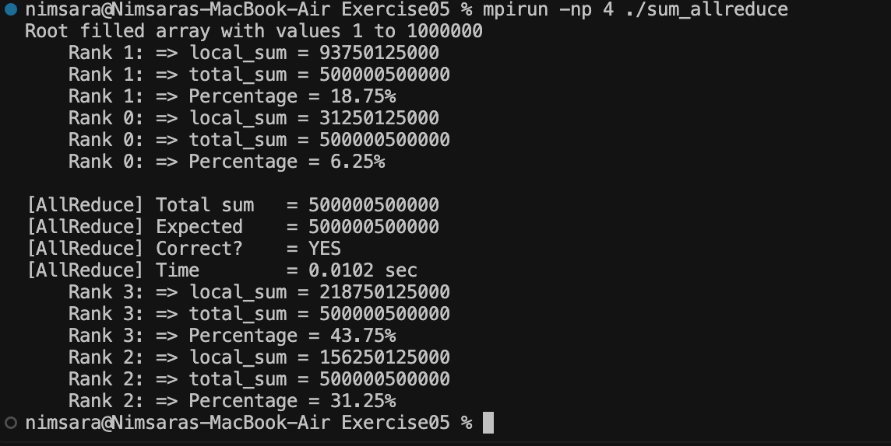

# Exercise 05 — MPI Allreduce

## Objective

This exercise improves the result distribution used in Exercise 04.

In Exercise 04, `MPI_Reduce` combined all `local_sum` values and stored the final result only on Rank 0.

In this exercise, `MPI_Allreduce` combines the partial sums using `MPI_SUM` and makes the final `total_sum` available to every MPI process.

This allows each rank to calculate its percentage contribution to the global sum.

## Improvement from Exercise 04

**Exercise 04**

```text
MPI_Scatter
     ↓
Each rank calculates local_sum
     ↓
MPI_Reduce + MPI_SUM
     ↓
total_sum only on Rank 0
```

**Exercise 05**

```text
MPI_Scatter
     ↓
Each rank calculates local_sum
     ↓
MPI_Allreduce + MPI_SUM
     ↓
total_sum available on every Rank
     ↓
Each Rank calculates its percentage
```

Unlike `MPI_Reduce`, `MPI_Allreduce` does not require a root process for receiving the result.

Every process receives the same global `total_sum`.

## Compile and Run

```bash
mpicc -o sum_allreduce sum_allreduce.c
mpirun -np 4 ./sum_allreduce
```

## Output

```text
Root filled array with values 1 to 1000000
    Rank 1: => local_sum = 93750125000
    Rank 1: => total_sum = 500000500000
    Rank 1: => Percentage = 18.75%
    Rank 0: => local_sum = 31250125000
    Rank 0: => total_sum = 500000500000
    Rank 0: => Percentage = 6.25%

[AllReduce] Total sum   = 500000500000
[AllReduce] Expected    = 500000500000
[AllReduce] Correct?    = YES
[AllReduce] Time        = 0.0102 sec
    Rank 3: => local_sum = 218750125000
    Rank 3: => total_sum = 500000500000
    Rank 3: => Percentage = 43.75%
    Rank 2: => local_sum = 156250125000
    Rank 2: => total_sum = 500000500000
    Rank 2: => Percentage = 31.25%
```

## Result

`MPI_Allreduce` successfully combined the partial sums from all 4 MPI processes.

Unlike `MPI_Reduce`, the final global sum was available to every rank:

**500,000,500,000**

This allowed each process to calculate its contribution to the total:

```text
Rank 0 →  6.25%
Rank 1 → 18.75%
Rank 2 → 31.25%
Rank 3 → 43.75%
```

The calculated total matched the expected result.

The rank output may appear in a different order because MPI processes execute concurrently.

## Proof

