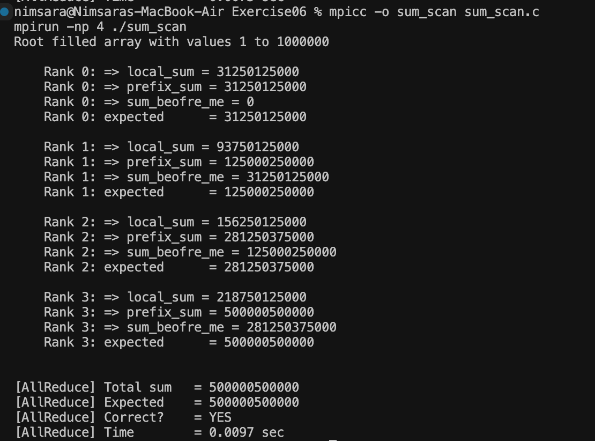

# Exercise 06 — MPI Scan

## Objective

This exercise replaces `MPI_Allreduce` from Exercise 05 with `MPI_Scan`.

Instead of giving every process the same global total, `MPI_Scan` performs a prefix reduction. Each rank receives the cumulative sum from Rank 0 up to its own rank.

This allows each process to determine both its cumulative `prefix_sum` and the total contribution from all ranks before it.

## Improvement from Exercise 05

**Exercise 05**

```text
MPI_Scatter
     ↓
Each rank calculates local_sum
     ↓
MPI_Allreduce + MPI_SUM
     ↓
Same total_sum available on every Rank
```

**Exercise 06**

```text
MPI_Scatter
     ↓
Each rank calculates local_sum
     ↓
MPI_Scan + MPI_SUM
     ↓
Different prefix_sum for each Rank
```

For each rank:

```text
prefix_sum    = sum of Rank 0 through current Rank
sum_before_me = prefix_sum - local_sum
```

The last rank contains the complete global sum.

## Compile and Run

```bash
mpicc -o sum_scan sum_scan.c
mpirun -np 4 ./sum_scan
```

## Output

```text
Root filled array with values 1 to 1000000

    Rank 0: => local_sum = 31250125000
    Rank 0: => prefix_sum = 31250125000
    Rank 0: => sum_before_me = 0
    Rank 0: expected      = 31250125000

    Rank 1: => local_sum = 93750125000
    Rank 1: => prefix_sum = 125000250000
    Rank 1: => sum_before_me = 31250125000
    Rank 1: expected      = 125000250000

    Rank 2: => local_sum = 156250125000
    Rank 2: => prefix_sum = 281250375000
    Rank 2: => sum_before_me = 125000250000
    Rank 2: expected      = 281250375000

    Rank 3: => local_sum = 218750125000
    Rank 3: => prefix_sum = 500000500000
    Rank 3: => sum_before_me = 281250375000
    Rank 3: expected      = 500000500000

[Scan] Final prefix = 500000500000
[Scan] Expected     = 500000500000
[Scan] Correct?     = YES
[Scan] Time         = 0.0097 sec
```

## Result

`MPI_Scan` successfully calculated a cumulative prefix sum for each MPI process.

The prefix values increased as each rank included the contribution of all previous ranks:

```text
Rank 0 →  31,250,125,000
Rank 1 → 125,000,250,000
Rank 2 → 281,250,375,000
Rank 3 → 500,000,500,000
```

Rank 3 is the last rank when running with 4 processes, so its `prefix_sum` represents the complete sum of the array.

The final value matched the expected result:

**500,000,500,000**

Each rank's prefix value was also verified using the expected sum formula.

## Proof

