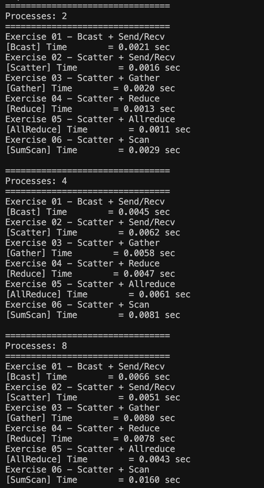

# Exercise 07 — MPI Collective Operations Comparison

## Objective

This exercise compares the six MPI implementations developed in Exercises 01–06.

The same array summation problem is executed using different MPI communication techniques to compare:

- Collective operations used
- Memory distribution
- Manual processing required on the root
- Location of the final result
- Execution time with 2, 4, and 8 MPI processes

All implementations calculate the sum of integers from `1` to `1,000,000`.

Expected result:

```text
500000500000
```

---

## 1. Implementation Comparison

| Exercise | Communication Method | Array Distribution | Manual Root Summation | Final Result Available |
|---|---|---|---|---|
| Exercise 01 | `MPI_Bcast` + `MPI_Send/Recv` | Full array on every process | Yes | Root only |
| Exercise 02 | `MPI_Scatter` + `MPI_Send/Recv` | Root has full array; other ranks receive chunks | Yes | Root only |
| Exercise 03 | `MPI_Scatter` + `MPI_Gather` | Root has full array; each rank processes a chunk | Yes | Root only |
| Exercise 04 | `MPI_Scatter` + `MPI_Reduce` | Root has full array; each rank processes a chunk | No | Root only |
| Exercise 05 | `MPI_Scatter` + `MPI_Allreduce` | Root has full array; each rank processes a chunk | No | All processes |
| Exercise 06 | `MPI_Scatter` + `MPI_Scan` | Root has full array; each rank processes a chunk | No | Different prefix result on each rank |

---

## 2. Progression of the Implementations

```text
Exercise 01
Bcast + Send/Recv
        ↓
Exercise 02
Scatter + Send/Recv
        ↓
Exercise 03
Scatter + Gather
        ↓
Exercise 04
Scatter + Reduce
        ↓
Exercise 05
Scatter + Allreduce
        ↓
Exercise 06
Scatter + Scan
```

Each exercise replaces part of the previous implementation with a more suitable MPI collective operation.

---

# Performance Testing

All six implementations were executed using:

```text
2 processes
4 processes
8 processes
```

## Execution Times

| Implementation | 2 Processes | 4 Processes | 8 Processes |
|---|---:|---:|---:|
| Bcast + Send/Recv | 0.0021 sec | 0.0045 sec | 0.0066 sec |
| Scatter + Send/Recv | 0.0016 sec | 0.0062 sec | 0.0051 sec |
| Scatter + Gather | 0.0020 sec | 0.0058 sec | 0.0080 sec |
| Scatter + Reduce | 0.0013 sec | 0.0047 sec | 0.0078 sec |
| Scatter + Allreduce | **0.0011 sec** | 0.0061 sec | **0.0043 sec** |
| Scatter + Scan | 0.0029 sec | 0.0081 sec | 0.0160 sec |

---

## 2-Process Results

With two MPI processes, `MPI_Allreduce` produced the lowest measured execution time:

```text
Bcast      = 0.0021 sec
Scatter    = 0.0016 sec
Gather     = 0.0020 sec
Reduce     = 0.0013 sec
Allreduce  = 0.0011 sec
Scan       = 0.0029 sec
```

### Proof


---

## 4-Process Results

With four processes, `MPI_Bcast` produced the lowest measured time in this run, with `MPI_Reduce` producing a very similar result.

```text
Bcast      = 0.0045 sec
Scatter    = 0.0062 sec
Gather     = 0.0058 sec
Reduce     = 0.0047 sec
Allreduce  = 0.0061 sec
Scan       = 0.0081 sec
```

### Proof


---

## 8-Process Results

With eight processes, `MPI_Allreduce` produced the lowest measured execution time.

```text
Bcast      = 0.0066 sec
Scatter    = 0.0051 sec
Gather     = 0.0080 sec
Reduce     = 0.0078 sec
Allreduce  = 0.0043 sec
Scan       = 0.0160 sec
```

### Proof


---

## Timing Comparison



The measured results show that increasing the number of processes does not automatically reduce execution time for this problem.

For an array of only 1,000,000 elements, the additional MPI communication and process coordination overhead can become significant compared with the actual computation.

`MPI_Allreduce` gave the lowest measured time for the 2-process and 8-process tests, while `MPI_Bcast` gave the lowest measured time in the 4-process test.

Because these are individual timing runs, small differences can also be affected by operating-system scheduling and other processes running on the computer.

---

# MPI Scan vs MPI Allreduce

`MPI_Allreduce` should be used when every process needs the same final global result.

For example:

```text
Rank 0 ─┐
Rank 1 ─┤
Rank 2 ─┼── MPI_Allreduce ──> Same total on every rank
Rank 3 ─┘
```

`MPI_Scan` should be used when each process needs a cumulative result based on all ranks before it.

For example:

```text
Rank 0 → local_0
Rank 1 → local_0 + local_1
Rank 2 → local_0 + local_1 + local_2
Rank 3 → local_0 + local_1 + local_2 + local_3
```

A practical use of `MPI_Scan` is calculating global offsets for distributed data.

Each process can calculate:

```text
sum_before_me = prefix_sum - local_sum
```

This tells a process how much work or data exists before its own section without requiring additional point-to-point communication.

---

## Conclusion

The exercises demonstrate how MPI collective operations can progressively simplify parallel communication.

`MPI_Scatter` avoids sending the complete input array to every process, `MPI_Gather` simplifies collection of partial results, and `MPI_Reduce` removes the need for manual summation.

`MPI_Allreduce` extends reduction by making the final result available to every process, while `MPI_Scan` provides cumulative prefix results that are useful when each process requires a different global offset.

All six implementations successfully produced the expected result:

```text
500000500000
```

The performance tests also demonstrate that using more MPI processes does not necessarily make a small workload faster because communication and synchronization introduce additional overhead.