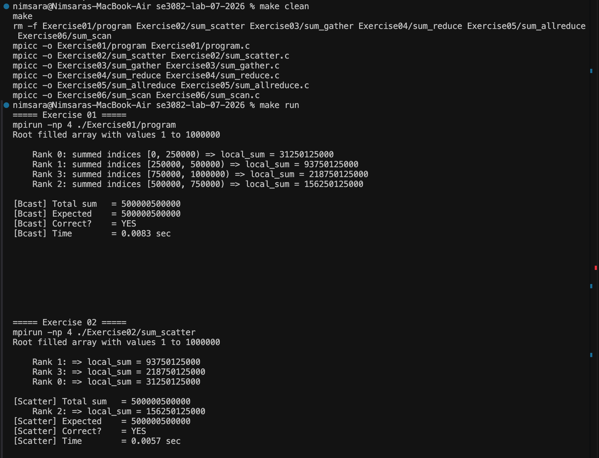
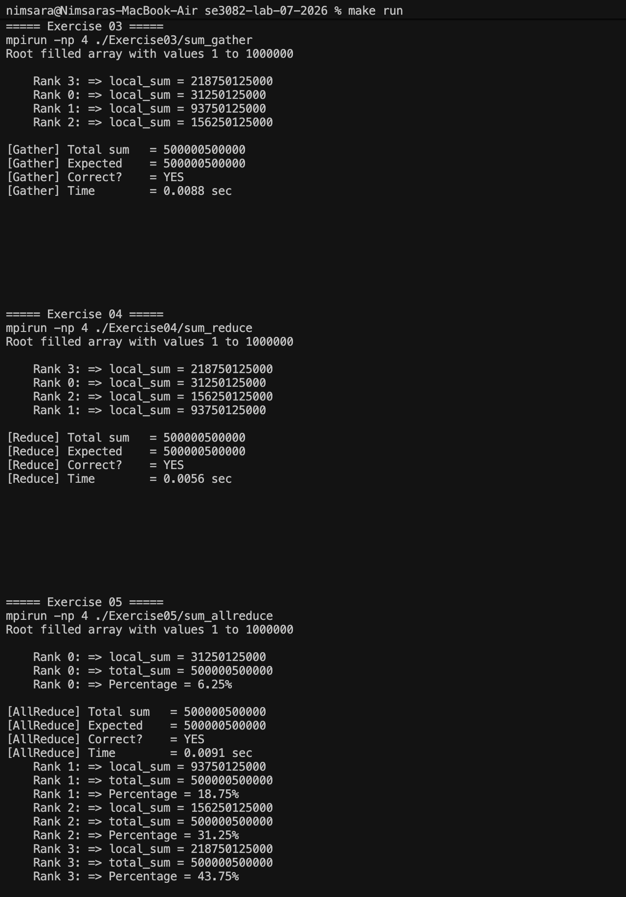
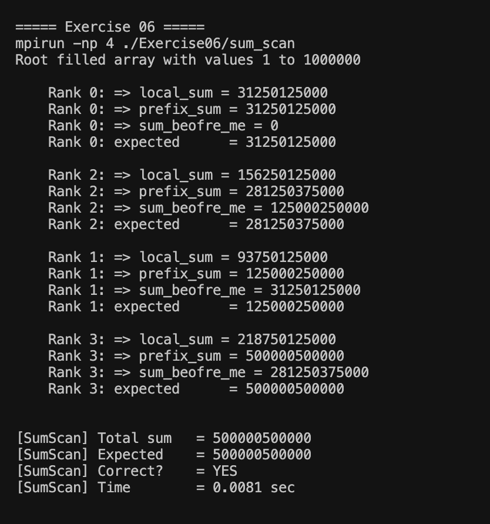

# Exercise 08 — Makefile Build and Run

## Objective

Create a `Makefile` that compiles all six MPI programs and provides a `run` target to execute them using 4 processes.

## Commands

Build all programs:

```bash
make
```

Run all programs with 4 MPI processes:

```bash
make run
```

Clean compiled executables:

```bash
make clean
```

## Result

The Makefile successfully compiles all six MPI programs and runs them using:

```bash
mpirun -np 4
```

This provides a single, simple way to build and execute all previous exercises.

## Proof





